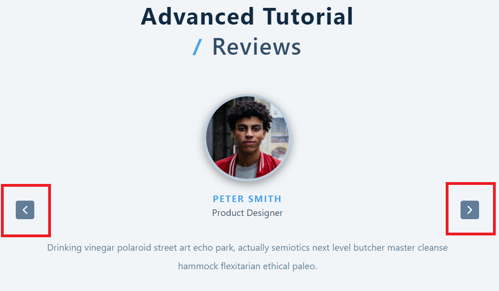
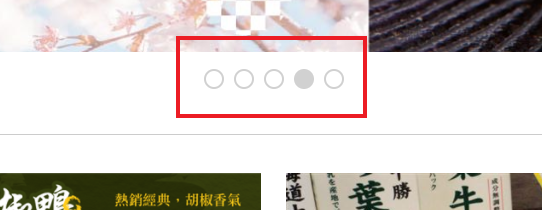

###### Web 程式設計(一) ---- 206410341 吳權恩

### 主動學習 -- Swiper 切換畫面

上課時是使用「往前」與「往後」兩個 **\<button>** 在 onClik 時 index 的值 +1 或 -1 來切換

這次要模仿的網站有 5 張圖片且下方有五個 **\<span>**

點擊第一個要切換到第一張圖、點第二個切換到第二張圖，以此類推，那可以使用以下語法來實現

```
<span
    className={position}
    onClick={() => setIndex(itemsIndex)}
></span>
```

用 onClik 把 setIndex 的值設為 itemsIndex，就可以了
