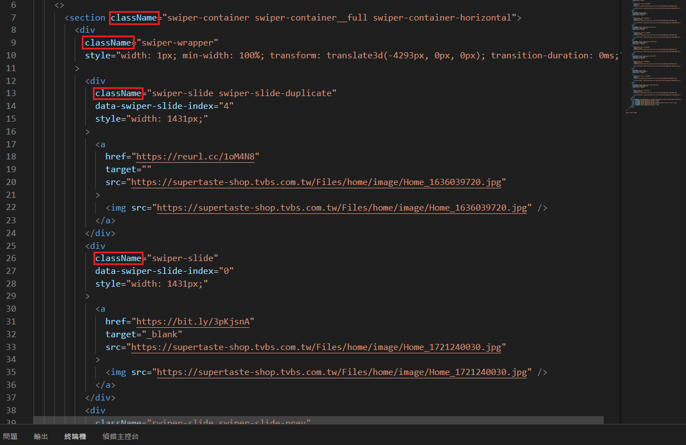

###### Web 程式設計(一) ---- 206410341 吳權恩

### 期末 Project 實作過程

#### Step 1. 在 Components 目錄底下新增 Swiper.js 與 Swiper.scss

##### Swiper.js :

建立框架，將 theme 中 Swiper 區域的 **\<section>** 與 **\<span>** 貼上，用 **Fragments <> </>** 包起來，再把 class 更改為 className，import Swiper.scss。



##### Swiper.scss :

Code:

```
.swiper-container {
  margin: 0 auto;
  width: 1519px;
  height: 659px;
  text-align: center;
  position: relative;
  display: flex;
  padding-bottom: 12px;
  //overflow: hidden;
  article {
    position: absolute;
    top: 0;
    left: 0;
    width: 1519px;
    height: 659px;
    opacity: 0;
  }
  img {
    //height: 500px;
    width: 100%;
    height: 100%;
    //max-width: 100%;
    //max-height: 100%;
  }
  .activeSlide {
    opacity: 1;
    z-index: 1;
    transform: translatex(0);
    transition-duration: 500ms;
  }
  .lastSlide {
    transform: translatex(-100%);
    transition-duration: 300ms;
  }
  .nextSlide {
    transform: translatex(0%);
    transition-duration: 300ms;
  }
}
.swiper-pagination {
  position: relative;
  text-align: center;
  width: 100%;
  height: 22px;
  .swiper-pagination-bullet {
    height: 12px;
    width: 12px;
    margin: 0 4px;
    border: 2px solid #ccc;
    border-radius: 100%;
    text-align: center;
    display: inline-block;
    cursor: pointer;
    opacity: 0.9;
  }
  .swiper-pagination-bullet-active {
    background-color: #ccc;
  }
}

```
